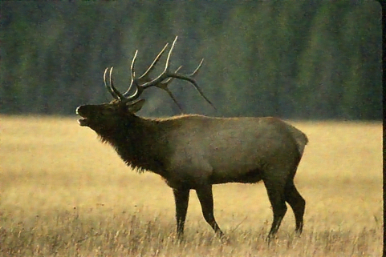

# How to use Deep Learning to restore images

This small repositery aims to use Deep Learning to create powerful methods to restore degraded images with noise, blur, compression, ... Two different scripts can be used :

- *train.py* : Script to train the deep convolutional network to restore specific degradations
- *infer.py* : Script to infer the model with pre-trained or custom weights on a specific image,  

The network used to restore images is called VDSR. 

## Requirements 

This repositery needs the following specifications to be fully functional : 

- **PyTorch 1.2**
- **Python 3.6**

Once the environment set, you only need to clone the repositery and activate the environment with the previous libraries.

## Training Procedure

The training procedure can be used to optimize the network on a specific dataset, that is to say a folder containing clean images. 

Two argument are required to launch the script : 

- *path* : Path to the folder containing the clean images to use for the training.
- *output_path* : Path to the folder within which the different weights of the network will be saved.

**Example** 

```console
python train.py "path/to/images" "path/to/weights"
```

Another optional arguments can be passed to the function, to modify the training procedure :

- *num_epochs* : Number of epochs to optimize the network
- *batch_size* : Size of the batch used during the training.
- *num_workers* : Number of CPU workers used to load data.
- *crop_size* : Size of the crop used during the training. 
- *learning_rate* : Value of the learning rate to use.
- *weight_decay* : Value of the weight decay to use.
- *max_noise_variance* : Maximum variance noise used during the training.
- *epoch_checkpoint* : Number of epochs between two consecutive model exports.

**Example with optional arguments** 

```console
python train.py "path/to/images" "path/to/weights" --batch_size 16 --num_workers 4 --epoch_checkpoint 2 --num_epochs 20
```

Once you've launched the script, the terminal will print the loss after each epoch as following : 

```console
Epoch 1/20
----------
Loss: 0.0007 

Epoch 2/20
----------
Loss: 0.0005 

.............

Epoch 19/20
----------
Loss: 0.0005 

Epoch 20/20
----------
Loss: 0.0005 

Training complete in 23m 0s
```

Note that you directly find the documentation of the different options by typing : 

```console
python train.py -h
```

## Inference Procedure

Whether you have trained or not the network, you can use pretrained weights or your own weight to denoise a custom image. 
You need to specify two arguments to use the inference script :
 
- *path* : Path to image which need to be denoised.
- *output_path* : Path where the resulting image will be stored.

**Example with pretrained weights** 

In the case, you want to use pretrained weights, you just have to type the following command :

```console
python infer.py "path/to/image" "path/to/result"
```

An example of results obtained with the pretrained network is illustrated below : 

**Noised Image :**


**Result of the inference:**



**Example with custom weights** 

To do the inference with your own weights, you just need to specify the weights, with the optional argument checkpoint_path as below :

```console
python infer.py "path/to/image" "path/to/result"  --checkpoint_path "path/to/weights"
```

Note that you directly find the documentation of the different options by typing : 

```console
python infer.py -h
```# TinyYOLOv3-Pytorch
